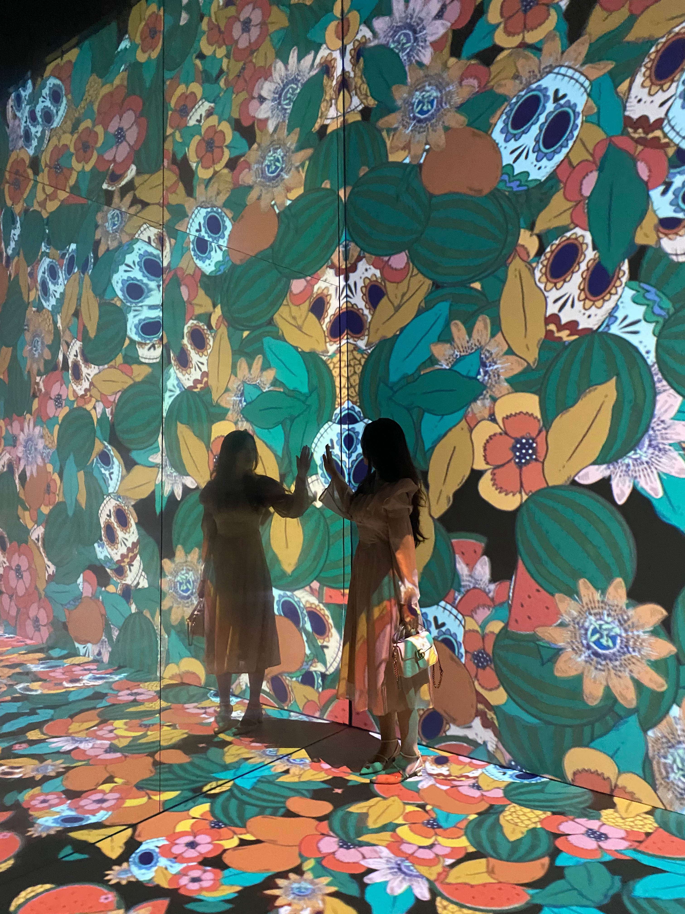

# ysun0715_9103_TUT2_Quiz8
Quiz 8 submission

**This is my research report**
## Part 1
### About the Assignment
- Our group chose Monet's 'Saint Georges majeur au crépuscule'
### About Inspiration
- This is me interacting with the artwork at the opening of SYDNEY FESTIVAL 2023 FRIDA KAHLO, FRIDA KAHLO: THE LIFE OF AN IDOL.
- This artwork inspires me. As people walk, the pattern of the ground spreads outward as it gathers together, like a flower. I think it's very similar to Monet's paintings, which are made up of many different colours of paint, like Frida's patterns. I pondered that it would be very interesting if the colours bloomed like this artwork as the mouse moved. So I think it helped me.
    - 
- Here's a dynamic interaction of artwork I found on YouTube.
    - [1:57-2:00 Showing the video author's dynamic pattern at the foot of this piece moving with her footsteps]https://www.youtube.com/watch?v=CNNvMCeGZT8
    - [0:09 Shows a dynamic view of the picture]https://www.youtube.com/watch?v=9ziv8HG9i4U